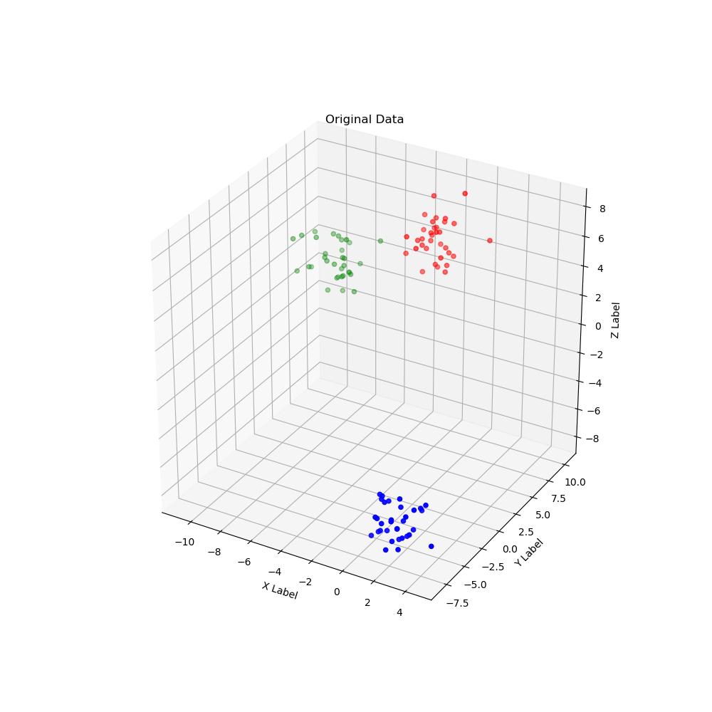
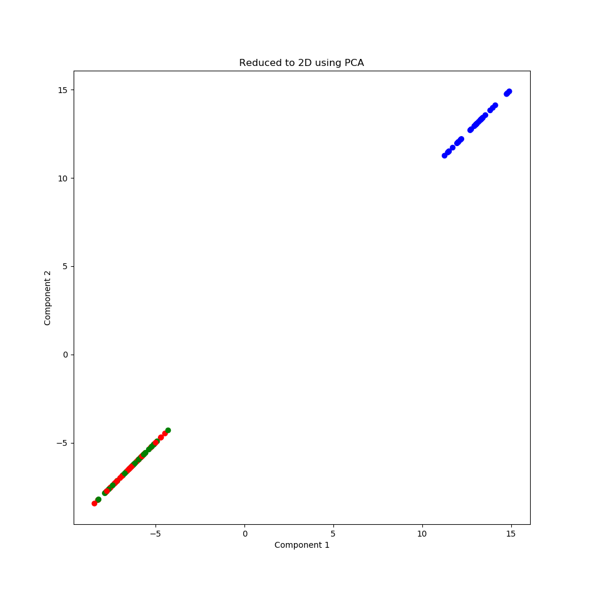
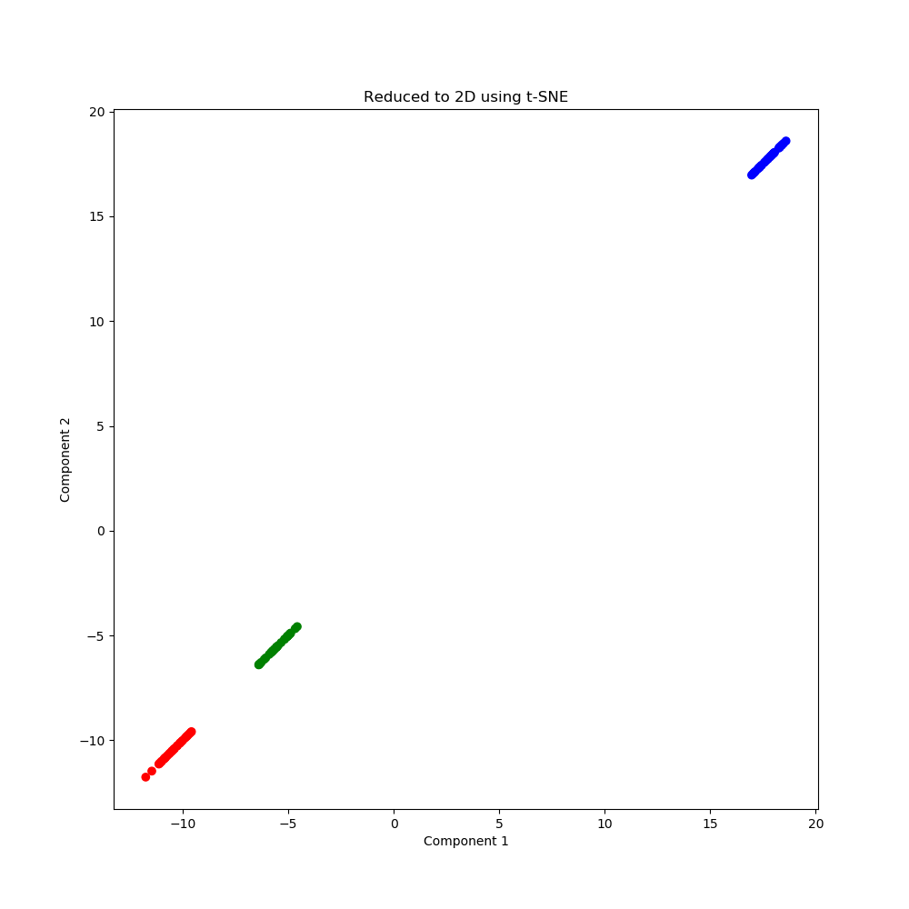

[](http://quantlet.de/)

## [](http://quantlet.de/) **DEDA_HClustering_tSNE_vs_PCA** [](http://quantlet.de/)

```yaml

Name of QuantLet : DEDA_HClustering_tSNE_vs_PCA

Published in : DEDA class

Description : 'Explanatory example for dimensionality reduction t-SNE vs PCA accompanying the hierarchical clustering project'

Keywords : Dimensionality reduction, t-SNE, PCA, cluster analysis

Author : Elizaveta Zinovyeva

Submitted : Fri, February 19 2019 by Elizaveta Zinovyeva

```







### PYTHON Code
```python

# Import modules
from mpl_toolkits.mplot3d import Axes3D
from sklearn.datasets.samples_generator import make_blobs
from sklearn.decomposition import PCA
from sklearn.manifold import TSNE

import matplotlib.pyplot as plt
import numpy as np

# Fixing random state for reproducibility
seed = 42
n = 100

# Functions
def colors(i):
    if i==0:
        i = 'red'
    elif i==1:
        i = 'blue'
    else:
        i = 'green'
    return(i)


# Simulate data
X, y = make_blobs(n_samples=n, centers=3, n_features=3, random_state=seed)
y_color = [colors(i) for i in y]

# Plot original 3d data
fig = plt.figure(figsize=(10, 10))
ax = fig.add_subplot(111, projection='3d')


xs = X[:,0]
ys = X[:,1]
zs = X[:,2]
ax.scatter(xs, ys, zs, c=y_color, marker='o')

ax.set_xlabel('X Label')
ax.set_ylabel('Y Label')
ax.set_zlabel('Z Label')
ax.set_title('Original Data')
plt.savefig('./DEDA_HClustering_tSNE_vs_PCA/original_data.png', transparent=True)


# PCA on 2-dimensions
pca = PCA(n_components=2, random_state=seed)
pca.fit(X)
pca_X = pca.fit_transform(X)

# Plot data with dimensionality reduction PCA
fig = plt.figure(figsize=(10, 10))
plt.scatter(pca_X[:,0], pca_X[:,0], c=y_color, marker='o')

plt.xlabel('Component 1')
plt.ylabel('Component 2')
plt.title('Reduced to 2D using PCA')

plt.savefig('./DEDA_HClustering_tSNE_vs_PCA/pca_reduce.png', transparent=True)

# t-SNE on 2-dimensions
tsne = TSNE(n_components=2, random_state=seed)
tsne.fit(X)
tsne_X = tsne.fit_transform(X)

# Plot data with dimensionality reduction PCA
fig = plt.figure(figsize=(10, 10))
plt.scatter(tsne_X[:,0], tsne_X[:,0], c=y_color, marker='o')

plt.xlabel('Component 1')
plt.ylabel('Component 2')
plt.title('Reduced to 2D using t-SNE')

plt.savefig('./DEDA_HClustering_tSNE_vs_PCA/tsne_reduce.png', transparent=True)
```

automatically created on 2019-02-20